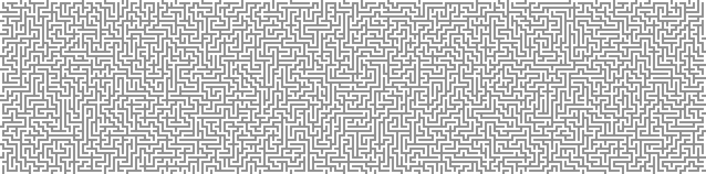

# Maze generation algorithm
<div align="center">
	
</div>
  
This is a rust program that generates a maze using a [stack-based iterative implementation](https://en.wikipedia.org/wiki/Maze_generation_algorithm).  
The resulting maze can/will be exported as a picture file
  
The making of this was inspired by [logicguy](https://github.com/logicguy1)  
 
## Usage
```shell
./[bin] [X] [Y] [pixel size (optional)] [output path (optional)]
```

### Automatic solving
THIS DOESN'T WORK YET!  
Switch back to the `master` branch. (please)
